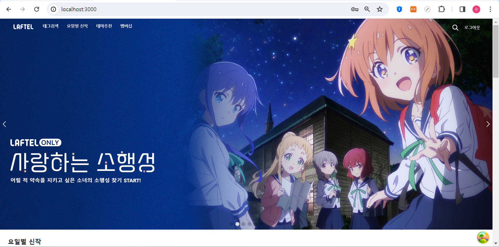
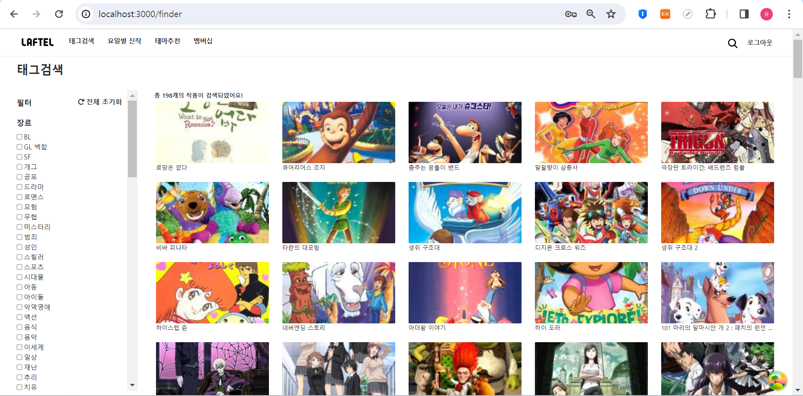
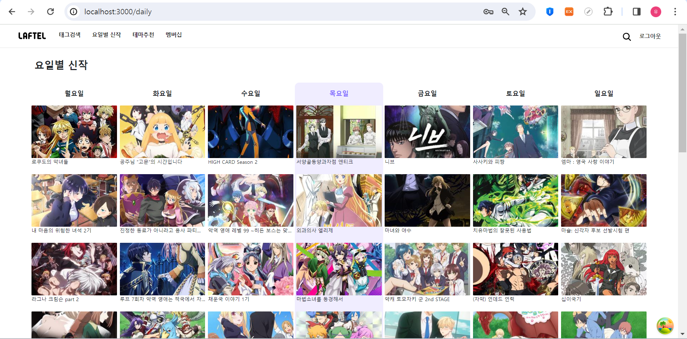
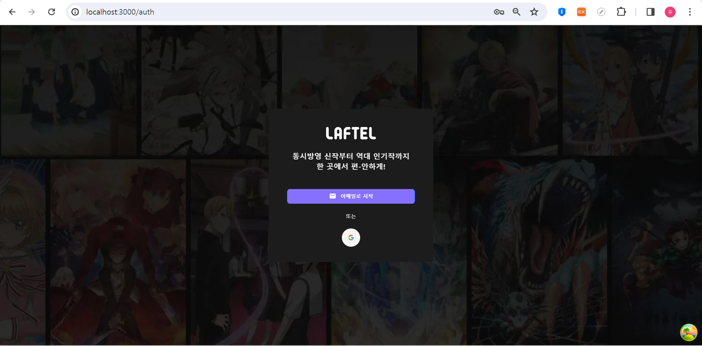
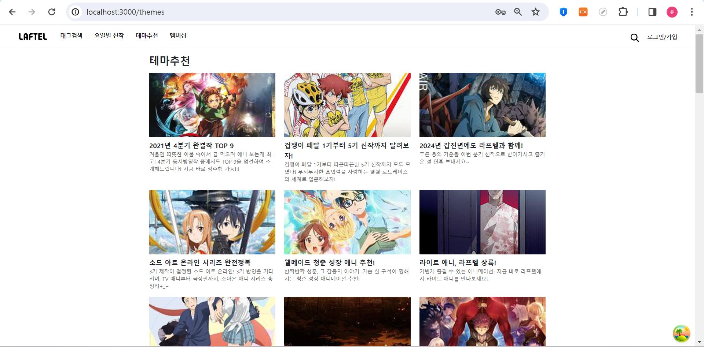
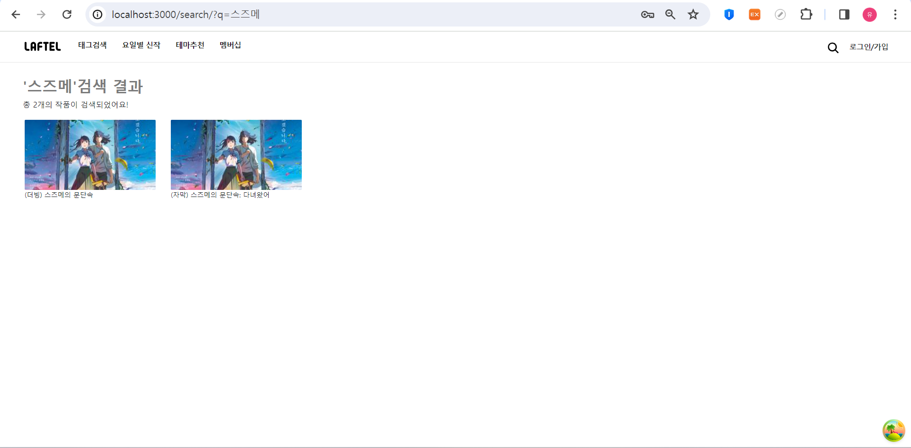
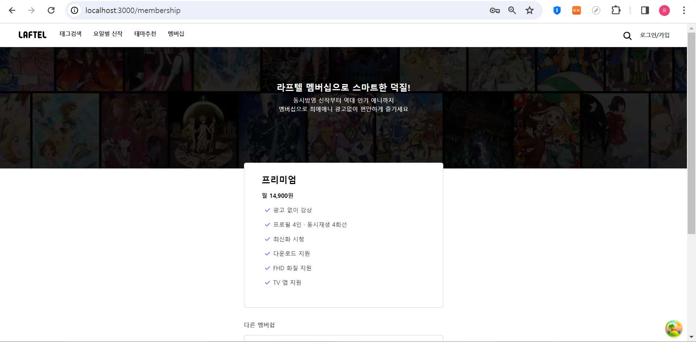
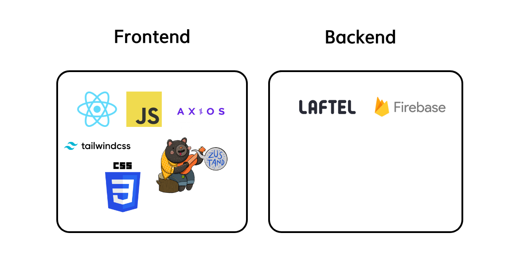

# 라프텔 클론 프로젝트

애니메이션 OTT 사이트 라프텔을 클론 코딩한 프로젝트입니다.

## 프로젝트 소개
- **개발 기간**: 2024.01 - 2024.03 (6주) 
- **플랫폼**: 반응형 웹  
- **개발 인원**: 1인 (개인 프로젝트)  

## 서비스 기능 소개
(사진을 클릭하면 영상이 재생됩니다.)
### 홈  

- 웹 사이트 접속 초기 화면으로, `홈 배너`, `요일 별 신작 슬라이더`, `테마 추천 슬라이더`를 볼 수 있습니다. 
- `요일 별 신작 슬라이더`는 현재 요일에 대한 신작을 기본으로 보여줍니다. 즉, 현재 목요일이면, 목요일 신작을 디폴트로 보여줍니다.
- `테마 추천 슬라이더`는 서비스 초기 렌더링 시 테마 추천 리스트를 10개씩 받아와 각 테마에 해당하는 애니메이션 리스트들을 보여줍니다. 

### 태그 검색  

- 파이어베이스에 저장한 애니메이션 중 필터에서 선택한 태그에 해당하는 애니메이션을 `필터링`하여 보여줍니다.
- `전체 초기화` 버튼을 누르면 필터가 초기화됩니다.

### 요일별 신작  

- 신작 데이터를 `라프텔 api`에서 받아 오고 요일 별로 분류 후, 각 요일 별 신작 형태로 가공하여 보여줍니다.
- 현재 요일에 해당하는 요일에는 퍼플 색상으로 포인트를 줍니다.

### 로그인 및 회원가입  

- `firebase authentication`을 통해 소셜 로그인 기능을 구현했습니다.
- `react-hook-form`, `zod`를 사용하여 회원가입 및 로그인 기능을 구현했습니다. 
- 회원가입시 이미 등록된 이메일인 경우 메시지를 보여주며, 비밀번호 입력 후 비밀번호 확인을 한 번 더 입력합니다.
- 비밀번호는 최소 8자, 최대 15자이며, 올바른 이메일 형식을 입력하였는지 확인합니다.  

### 테마 추천  

- `라프텔 api`로 추천 테마 리스트를 axios로 받아옵니다. 
- 추천 테마 카드를 클릭하면, 테마에 해당하는 애니메이션과 애니메이션에 대한 정보가 리스트 형태로 보여집니다. 

### 검색  

- 검색 창에 키워드를 입력 후 엔터를 누르면, `/search/?q=${keyword}` 형식으로 url이 바뀝니다. 
- `useSearchParams`를 통해 url에 있는 keyword를 get하며, 해당 키워드에 해당하는 애니메이션을 필터링하여 검색 결과창에 보여줍니다. 
- 모바일 및 태블릿 화면에서도 어색하지 않은 화면을 보여주기 위해 돋보기가 눌려있는 상태에서 화면 사이즈가 1024px 이하가 되면 검색 전용 페이지로 이동합니다. 

### 멤버십  

- 멤버십 종류에 대한 내용을 보여줍니다. 

## 서비스 구성

### **Front-end**  
- 프레임워크: `React.js`  
- 언어: `JavaScript`, `css`  
- CSS 프레임워크: `tailwindCSS`  
- api 통신: `Axios`  
- 상태 관리: `Zustand`  

### **Back-end**  
- API: `Laftel api`  
- 데이터베이스: `Firebase`  

## 기술 채택 이유
- React: 
    - 컴포넌트 단위로 개발함으로써 코드의 **유지보수성**을 높이기 위해 사용했습니다. 
    - 애니메이션 카드, 애니메이션 상세 모달 등 중복되는 코드를 컴포넌트화하여 **재사용**하며 깔끔한 코드 베이스를 지향하였습니다. 

- tailwindCSS:
    - 사전 정의된 클래스를 활용하여 빠르게 스타일링을 적용할 수 있다는 장점이 있어 tailwindCSS를 사용해보았습니다.

- Zustand:
    - props만을 사용하여 상태를 전달하는 경우, 상위 컴포넌트에서 하위 컴포넌트를 props로 전달하는 방식입니다. 이는 컴포넌트 간의 상태 공유를 **복잡**하게 하기 때문에 상태 관리 라이브러리를 사용하였습니다. 
    - Zustand는 Redux에 비해 사용 방식이 단순하고 간결하며, 짧은 기간동안 프로젝트를 진행하는 입장에서 러닝 커브가 낮아 해당 기술을 선택하였습니다. 

- Firebase:
    - 파이어베이스에서 제공하는 Database와 Auth 기능을 활용하면 클라이언트 측 작업만 진행하여 프론트엔드 개발에 더욱 집중할 수 있도록 결정하였습니다.  
    - Firebase Authentication을 통해 쉽게 소셜 로그인 인증을 할 수 있습니다. 
    - 태그 검색을 구현할 때, 매번 API를 통해 60~70개의 애니메이션 데이터를 불러오는 방식은 효율적이지 않았습니다. 
    - `태그 검색`을 개발할 때, 60~70개의 애니메이션 데이터를 매번 api로 불러오는 것은 시간적, 공간적으로 비효율적이었습니다. 이에 반해 파이어베이스를 사용하니, 60~70개의 애니메이션 데이터를 매번 불러오는 것보다 약 200개 정도의 애니메이션 데이터를 데이터베이스에서 불러오는 것이 훨씬 빨랐습니다. 이로 인해 태그 검색에서 태그 필터링을 할 때 애니메이션을 불러오는 속도가 개선되었습니다. 

## 주요 기술 과제 및 트러블 슈팅
[요일별 신작 구현 및 트러블 슈팅](https://github.com/ChunEunyu/laftel-clone-project/wiki/%EC%9A%94%EC%9D%BC-%EB%B3%84-%EC%8B%A0%EC%9E%91-%EA%B8%B0%EB%8A%A5-%EA%B5%AC%ED%98%84)
